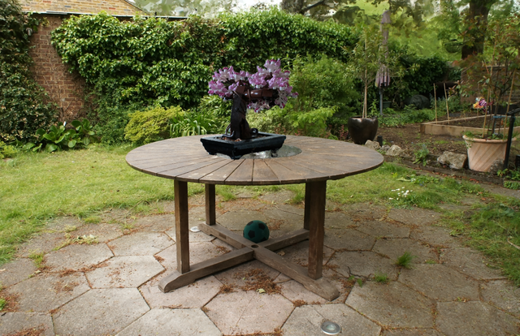
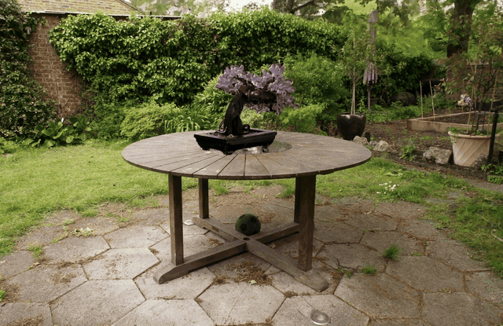
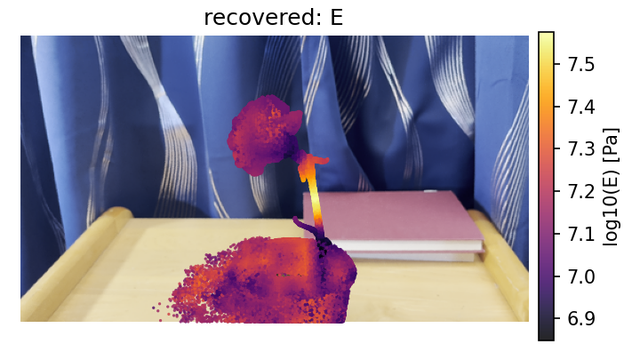
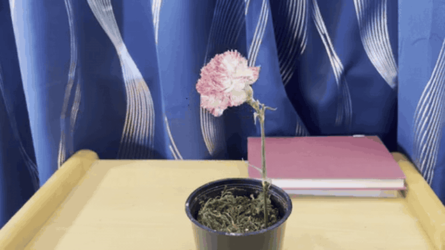
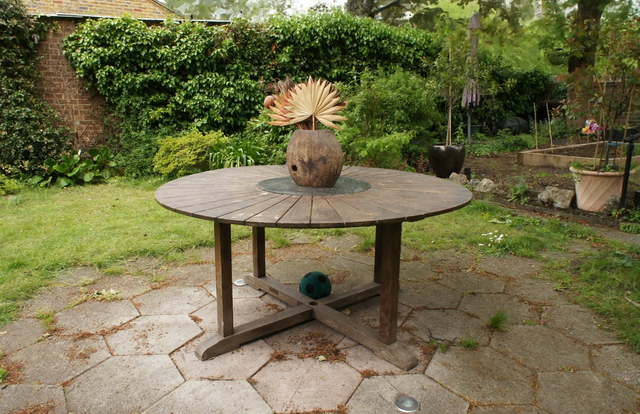
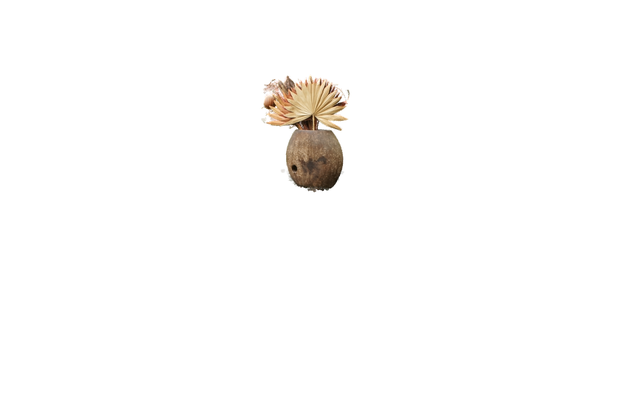
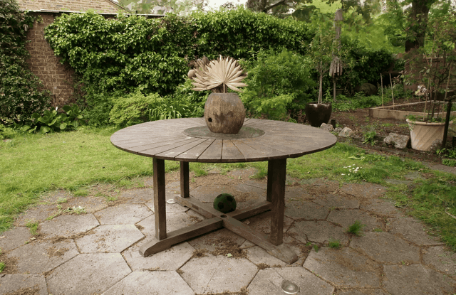
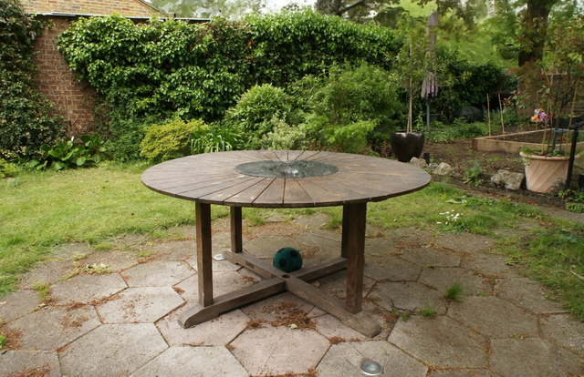
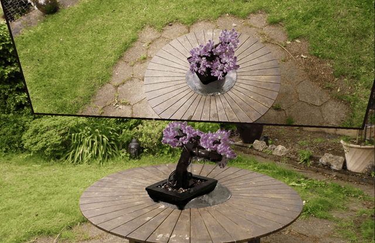

# PowerSim: Differentiable Physics Simulation and Rendering with Power Diagrams

Official code for **PowerSim: Differentiable Physics Simulation and Rendering with Power Diagrams**.
Trong-Tung Nguyen, Anand Bhattad. [Paper](https://arxiv.org/abs/2609.38153) · [Project website](https://power-sim.github.io)

## Overview

PowerSim is a differentiable physics simulation framework that couples a pre-trained
[PowerFoam](https://github.com/theialab/powerfoam) scene with the Material Point Method (MPM).
PowerSim supports several 3D applications such as physics simulation, material properties
optimization, scene editing, and reflection rendering on dynamic scenes.

## Setting up Environments

```bash
conda create -n powersim python=3.11 -y
conda activate powersim
export PYTHONNOUSERSITE=1
python -m pip install -r requirements.txt
```

## Data and Pre-trained Checkpoints

All checkpoints and assets are hosted on Hugging Face at
[Tung11/PowerSim](https://huggingface.co/datasets/Tung11/PowerSim).

```bash
python scripts/download_checkpoints.py
```

## Simulation with Pre-trained Checkpoints

Poke the bonsai tree composited into the garden scene (paper Fig. 1):

```bash
bash scripts/foam_evolve/run_garden_bonsai_poke.sh      # -> outputs/sim_results/garden_bonsai_poke/output.mp4
```

<table>
  <tr>
    <td align="center"><br/>Static Scene</td>
    <td align="center"><br/>Poking the Bonsai</td>
  </tr>
</table>

## Material Properties Estimation from a Single Video

### Option A: Pre-trained checkpoint for the carnation scene

We provide the pre-trained carnation checkpoint together with the optimized material field.
Run the poking simulation shown in the paper with it:

```bash
bash scripts/foam_evolve/run_carnation_poke.sh          # -> outputs/sim_results/carnation_poke/output.mp4
```

### Option B: Material property optimization from a single video

Given a single video, we provide an example on how to optimize the material properties. We use
the carnation scene as an example in this case:

```bash
bash scripts/material_estimation/run_carnation.sh       # -> outputs/material_estimation/carnation/
```

The recovered field (`material_field.pt`) then drives the simulation:

```bash
MATERIAL_FIELD=outputs/material_estimation/carnation/material_field.pt bash scripts/foam_evolve/run_carnation_poke.sh
```

<table>
  <tr>
    <td align="center"><br/>Optimized Young's Modulus</td>
    <td align="center"><br/>Simulation Result</td>
  </tr>
</table>

## Scene Editing

### Selecting primitives for simulation

An object's primitives are selected from 2D masks by render-weighted voting, with no optimization
required. We show an example usage where we first run SAM to select 2D masks of the objects/parts
of interest from different views of the scene, and then apply render-weighted voting to select the
targeted primitives for simulation. Below is our example on the garden scene, where the vase and
its frond are selected and then toppled by an impulse and gravity:

```bash
bash scripts/foamedit/run_sam_select.sh                 # photos -> SAM masks -> voting -> outputs/foamedit/sam_select/garden_vase_topple
```

<table>
  <tr>
    <td align="center"><br/>Garden Scene</td>
    <td align="center"><br/>Selected Primitives</td>
  </tr>
</table>

With masks already at hand, we can run simulation on the selected object. Here we simulate vase
toppling:

```bash
bash scripts/foamedit/run_select_and_simulate.sh        # masks -> voting -> outputs/sim_results/garden_vase_topple/output.mp4
```

<p align="center"><br/>Toppling the Vase</p>

### Removing and inserting objects

With the selected primitives, we can remove and insert new objects. In this example, we
demonstrate how to remove the vase and insert a bonsai captured separately:

```bash
bash scripts/foamedit/run_garden_bonsai.sh              # -> outputs/foamedit/garden_bonsai/garden_v1_bonsai_edit
```

which selects the vase from the 2D masks, removes it, and inserts the bonsai with a similarity
transform onto the tabletop. The result is a simulation-ready scene (the input of the bonsai poke
above).

<table>
  <tr>
    <td align="center"><br/>Vase Removed</td>
    <td align="center"><br/>Bonsai Inserted</td>
  </tr>
</table>

## Reflection with Dynamic Scene

Another interesting application of PowerSim is that it can reflect a dynamic scene via a mirror,
thanks to the secondary ray tracing capability of PowerFoam. We show an example of placing a mirror
and reflecting the motion of the poked bonsai:

```bash
bash third_party/geogram_psm/build.sh                    # once: the exact power-diagram adjacency used by the ray tracer
bash scripts/foam_evolve/run_garden_bonsai_mirror.sh     # -> outputs/sim_results/garden_bonsai_mirror/output.mp4
```

<p align="center"><br/>Reflecting the Poked Bonsai</p>

## Citation

```bibtex
@article{nguyen2026powersim,
  title   = {PowerSim: Differentiable Physics Simulation and Rendering with Power Diagrams},
  author  = {Nguyen, Trong-Tung and Bhattad, Anand},
  journal = {arXiv preprint arXiv:2609.38153},
  year    = {2026}
}
```

PowerSim builds on [PowerFoam](https://github.com/theialab/powerfoam) and the MPM solver of
[PhysGaussian](https://github.com/XPBD-Taichi/PhysGaussian), both vendored under `third_party/`.
